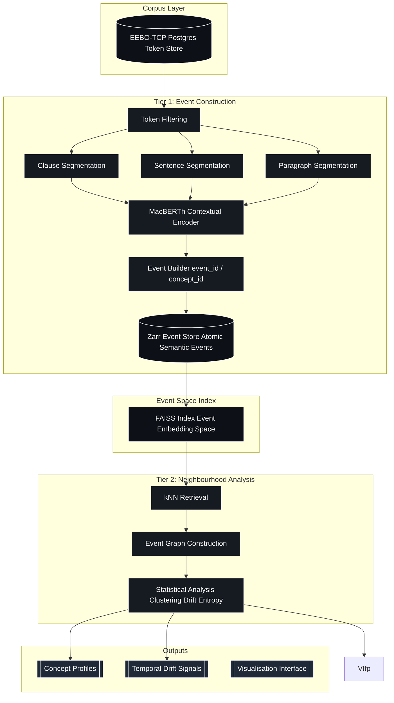

# _Mutatis Mutandis_

    git@github.com:leegee/mutatis-mutandis.git
    https://github.com/leegee/mutatis-mutandis.git

## Code Synopsis

    conda activate eebo_env             # Load Python environment
    ./pipeline --all                    # Ingest the XML corpus from eebo_all
    ./run-ws.sh                         # Run the WebSocket service for diachronic search
    cd gui/eebo-frontend && bun dev     # Run the frontend dev server

## Conceptual Synopsis

> Who today is using the concept of liberty as it was used by Milton, or Hobbes, or Locke?
>
> Who during the 1600s was expressing in their own language concepts we differntly express today?
>
> How in the past was the concept we term X referenced  if at all?

## Progress

Ideally this project would build a complete Ontological Topology of a corpus, a gigantic semantic space as a structured geometric object, where meaning is illustrated by relative positions, continuity and deformation of distributions across time, rather than through dictionaries. Nice idea but requires 2-5 days GPU or about 6 weeks of CPU...

So: instead of corpus-wide embedding, we recursively probe system where semantic topology is reconstructed through anchored neighbourhood expansion rather than exhaustive representation.

    EEBO-TCP TEI XML
            |
    Postgres (text + meta)
            |
    Zarr (event log: contextual embeddings)
            |
    FAISS (approximate semantic geometry index)
            |
    Query layer (token/window/hybrid encoding)
            |
    Analysis (drift, clustering, interpretation)
            |
    GUI (Solid, d3, CosmosGL, DeckGL)


Currently extending from individual tokens to clauses, which is where the real definitional use lies. After that, sentances and paragraphs.

- Zarr store extended
- New columns (event_type, span_*) populated
- Backward compatibile

## Architecture



## Deps list

    conda list --export > requirements.txt

## Colab Notebooks

Update `./macberth_pg_secrets.json` on Google Drive's root dir with the host/port output from `ngrok tcp 5432`.

Don't forget to restart the Colab session when the IP changes.

(Colab workbooks is well out of date)

## Bibliography

See [Bibliography](./BIBLIOGRAPHY.md)

## People and Projects

- [Bodleian Repo](https://ota.bodleian.ox.ac.uk/repository/xmlui/handle/20.500.12024/A50955)
- [Early English Books Online Text Creation Partnership (EEBO TCP), Bodleian Digital Library Systems & Services](https://digital.humanities.ox.ac.uk/project/early-english-books-online-text-creation-partnership-eebo-tcp)
- [Early Modern Manuscripts Online (EMMO)](https://folgerpedia.folger.edu/Early_Modern_Manuscripts_Online_%28EMMO%29?utm_source=chatgpt.com)
- [Heuser, Ryan](https://www.english.cam.ac.uk/people/Ryan.Heuser)
- [MacBERTHh](https://huggingface.co/emanjavacas/MacBERTh)
- [Manuscript Pamphleteering in Early Stuart England](https://tei-c.org/activities/projects/manuscript-pamphleteering-in-early-stuart-england/)
- [McGillivray, Barbara](https://www.kcl.ac.uk/people/barbara-mcgillivray)

- https://dhq.digitalhumanities.org/
- https://openhumanitiesdata.metajnl.com/
- https://www.openlibhums.org/

In addition to EEBO-TCP:

| Resource                                              | Focus                           | Contains TEI/XML? | Best Use                           |
| ----------------------------------------------------- | ------------------------------- | ----------------- | ---------------------------------- |
| **EarlyPrint / aggregated XML**                       | Multi‑collection metadata + XML | Yes               | Indexed TEI + multi‑collections    |
| **EBBA**                                              | 17th‑c ballads                  | Structured text   | Genre adjacent to pamphlets        |
| **ECCO‑TCP**                                          | 18th‑c books & pamphlets        | Yes               | Later historical context           |
| **Evans‑TCP**                                         | American imprints               | Yes               | Wider corpus coverage              |
| **HathiTrust Extracted Dataset**                      | Broad public domain texts       | Bulk data         | Pre‑processing into TEI            |
| **Manuscript Pamphleteering in Early Stuart England** | 17th‑c manuscript pamphlets     | Yes               | Manuscript pamphlet transcriptions |
| **MoEML Early Modern Broadsides**                     | 16–17th‑c broadsides            | Yes               | Printed sheets & broadsides        |

## Restoring the Database

Make sure the table space is on an SSD:

```sql
    CREATE TABLESPACE eebo_space LOCATION 'D:/postgres-data-2/eebo';
```

Create a temp tablespace if not already and use it for sorting/indexing:

```sql
    CREATE TABLESPACE temp_space LOCATION 'D:/postgres-data-2/temp';
```

Increase memory for faster index creation

```sql
    ALTER SYSTEM SET temp_tablespaces = 'temp_space';
    ALTER SYSTEM SET maintenance_work_mem = '16GB';  -- big enough for token indexes
    ALTER SYSTEM SET work_mem = '256MB';             -- per sort operation
    SELECT pg_reload_conf();
```

Kill all connections:

```sql
    SELECT pg_terminate_backend(pid)
    FROM pg_stat_activity
    WHERE datname='eebo';
```

Restore with 4 workers:

```bash
    pg_restore -v -d eebo -j 4 "./db-backup/eebo_backup.dump"
```

Monitor:

```sql
    -- Active queries (shows index creation)
    SELECT pid, now() - query_start AS duration, state, query
    FROM pg_stat_activity
    WHERE state <> 'idle';

    -- Size of largest tables and indexes
    SELECT relname, pg_size_pretty(pg_total_relation_size(relid))
    FROM pg_stat_user_tables
    ORDER BY pg_total_relation_size(relid) DESC;
```

Clean up:

```sql
    ALTER SYSTEM RESET maintenance_work_mem;
    ALTER SYSTEM RESET work_mem;
    ALTER SYSTEM RESET temp_tablespaces;
    SELECT pg_reload_conf();
```

## CPU-Bound

For now the methodology is focuosed on my ancient CPU-only (Radeon...), 64 GB setup so fastText over MacBERTh.

## To Do

1. api result paging
1. expose tier 2's analytics

### DB

- Tidy MV `pamphlet_tokens` and use a join rather than cutting corners
- Tidy schema and put it in its own file!

### EEBO-TCP Language Composition

Within the activated corpus bounds prior to `langdetect`:

```
eebo=# SELECT lang, COUNT(*) AS count
eebo-# FROM documents
eebo-# GROUP BY lang
eebo-# ORDER BY count DESC;
 lang | count
------+-------
 eng  | 39623
 lat  |   255
 wel  |    83
 fre  |    48
 frm  |     8
 dut  |     7
 mul  |     2
 sco  |     2
 spa  |     2
 ger  |     2
 grc  |     1
 gla  |     1
 new  |     1
 por  |     1
 ```

## Screenshots


