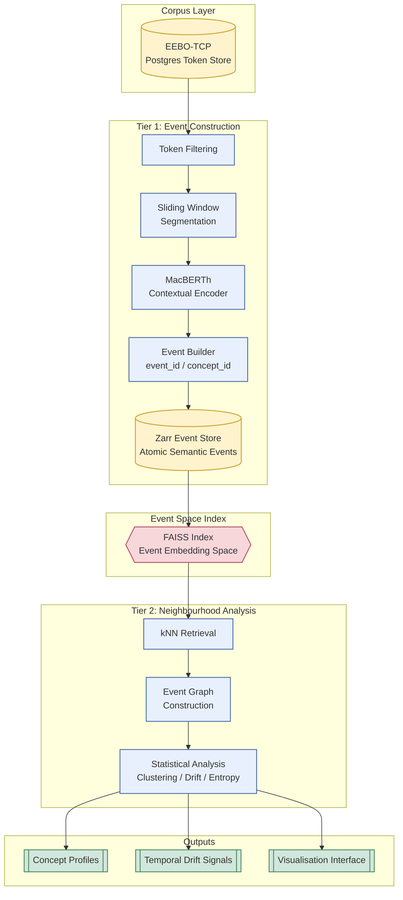

# _Mutatis Mutandis_

    git@github.com:leegee/mutatis-mutandis.git
    https://github.com/leegee/mutatis-mutandis.git

## Code Synopsis

To use the GUI on the final SQLite3 db:

    gunzip -k public/data/tier2_concept_neighbours.db.gz

To run the pipeline that produces the db:

    conda activate eebo
    ./pipeline --help

## Conceptual Synopsis

Ontological Topology: the study of semantic space as a structured geometric object, where meaning is defined by relative positions, continuity, and deformation of distributions across time rather than discrete sense inventories. Nice idea but requires 2-5 days GPU or about 6 weeks of CPU...

So: instead of corpus-wide embedding, I am trying a recursive probe system where semantic topology is reconstructed through anchored neighbourhood expansion rather than exhaustive representation.

Finally, attempt topological data analysis if I can get my head around the Betti numbers.

    EEBO-TCP TEI XML
            |
    Postgres (text + meta)
            |
    Zarr (event log: contextual embeddings)
            |
    FAISS (approximate semantic geometry index)
            |
    Query layer (token/window/hybrid encoding)
            |
    Analysis (drift, clustering, interpretation)
            |
    GUI (Solid, d3)

## Architecture



## Deps list

    conda list --export > requirements.txt

## Colab

Update `./macberth_pg_secrets.json` on Google Drive's root dir with the host/port output from `ngrok tcp 5432`.

Don't forget to restart the Colab session when the IP changes.

(Colab workbooks is well out of date)

## Abstract: About This Project

- [Abstract](./ABSTRACT.md)
- [Concise abstract](./ABSTRACT_concise.md)

## Bibliography

See [Bibliography](./BIBLIOGRAPHY.md)

## People and Projects

- [Manuscript Pamphleteering in Early Stuart England](https://tei-c.org/activities/projects/manuscript-pamphleteering-in-early-stuart-england/)
- [Heuser, Ryan](https://www.english.cam.ac.uk/people/Ryan.Heuser)
- [McGillivray, Barbara](https://www.kcl.ac.uk/people/barbara-mcgillivray)
- [MacBERTHh](https://huggingface.co/emanjavacas/MacBERTh)
- [Bodleian Repo](https://ota.bodleian.ox.ac.uk/repository/xmlui/handle/20.500.12024/A50955)
- [Early Modern Manuscripts Online (EMMO)](https://folgerpedia.folger.edu/Early_Modern_Manuscripts_Online_%28EMMO%29?utm_source=chatgpt.com)
- [Early English Books Online Text Creation Partnership (EEBO TCP), Bodleian Digital Library Systems & Services](https://digital.humanities.ox.ac.uk/project/early-english-books-online-text-creation-partnership-eebo-tcp)

- https://dhq.digitalhumanities.org/
- https://openhumanitiesdata.metajnl.com/
- https://www.openlibhums.org/

In addition to EEBO-TCP:

| Resource                                              | Focus                           | Contains TEI/XML? | Best Use                           |
| ----------------------------------------------------- | ------------------------------- | ----------------- | ---------------------------------- |
| **Manuscript Pamphleteering in Early Stuart England** | 17th‑c manuscript pamphlets     | Yes               | Manuscript pamphlet transcriptions |
| **MoEML Early Modern Broadsides**                     | 16–17th‑c broadsides            | Yes               | Printed sheets & broadsides        |
| **EarlyPrint / aggregated XML**                       | Multi‑collection metadata + XML | Yes               | Indexed TEI + multi‑collections    |
| **ECCO‑TCP**                                          | 18th‑c books & pamphlets        | Yes               | Later historical context           |
| **Evans‑TCP**                                         | American imprints               | Yes               | Wider corpus coverage              |
| **EBBA**                                              | 17th‑c ballads                  | Structured text   | Genre adjacent to pamphlets        |
| **HathiTrust Extracted Dataset**                      | Broad public domain texts       | Bulk data         | Pre‑processing into TEI            |

## Restoring the Database

Make sure the table space is on an SSD:

```sql
    CREATE TABLESPACE eebo_space LOCATION 'D:/postgres-data-2/eebo';
```

Create a temp tablespace if not already and use it for sorting/indexing:

```sql
    CREATE TABLESPACE temp_space LOCATION 'D:/postgres-data-2/temp';
```

Increase memory for faster index creation

```sql
    ALTER SYSTEM SET temp_tablespaces = 'temp_space';
    ALTER SYSTEM SET maintenance_work_mem = '16GB';  -- big enough for token indexes
    ALTER SYSTEM SET work_mem = '256MB';             -- per sort operation
    SELECT pg_reload_conf();
```

Kill all connections:

```sql
    SELECT pg_terminate_backend(pid)
    FROM pg_stat_activity
    WHERE datname='eebo';
```

Restore with 4 workers:

```bash
    pg_restore -v -d eebo -j 4 "./db-backup/eebo_backup.dump"
```

Monitor:

```sql
    -- Active queries (shows index creation)
    SELECT pid, now() - query_start AS duration, state, query
    FROM pg_stat_activity
    WHERE state <> 'idle';

    -- Size of largest tables and indexes
    SELECT relname, pg_size_pretty(pg_total_relation_size(relid))
    FROM pg_stat_user_tables
    ORDER BY pg_total_relation_size(relid) DESC;
```

Clean up:

```sql
    ALTER SYSTEM RESET maintenance_work_mem;
    ALTER SYSTEM RESET work_mem;
    ALTER SYSTEM RESET temp_tablespaces;
    SELECT pg_reload_conf();
```

## CPU-Bound

For now the methodology is focuosed on my ancient CPU-only (Radeon...), 64 GB setup so fastText over MacBERTh.

## To Do

### Data

1. Cleaner corpus text
1. Fuller corpus date parsing

### Visualisations

1. Share a JSON config for constants such as corpus year range, window size, etc
1. Cosmos animation - compute the cosmos for all years and fade out those not currently in the animation frame.
1. 3D with x/y being current FDG or heatmap, z being time
1. api result paging

### DB

- Tidy MV `pamphlet_tokens` and use a join rather than cutting corners
- Tidy schema

## Screenshots


