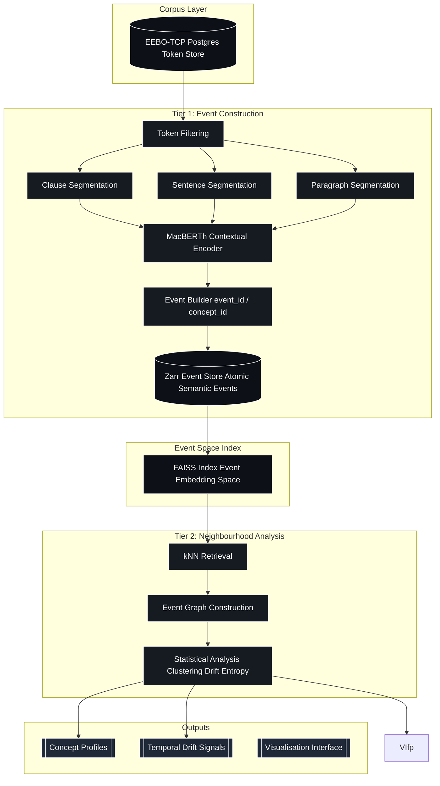
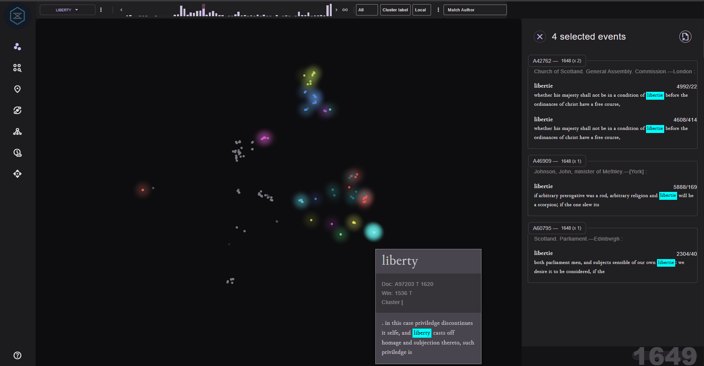
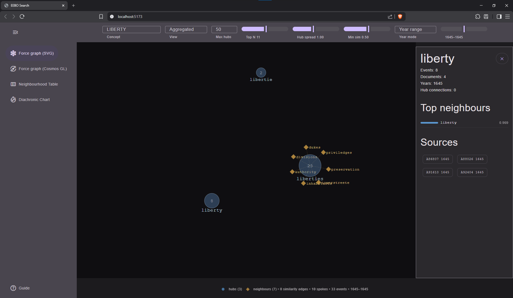
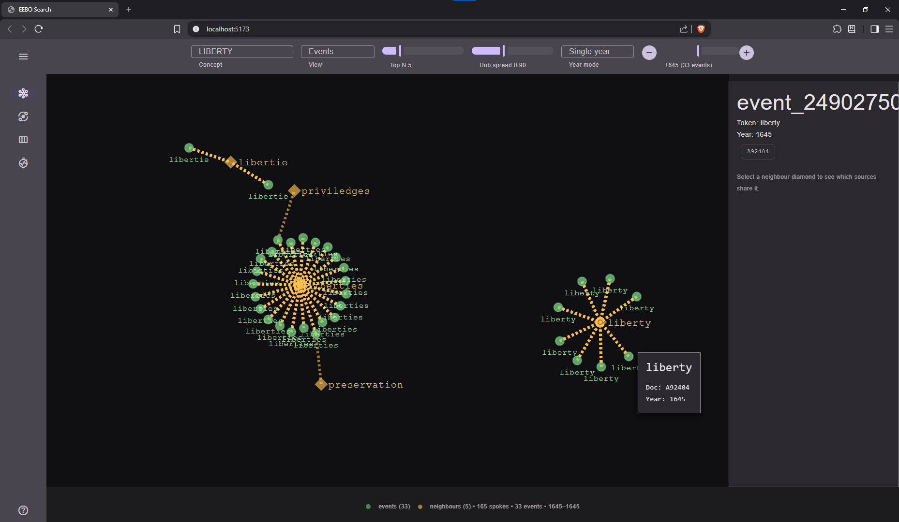
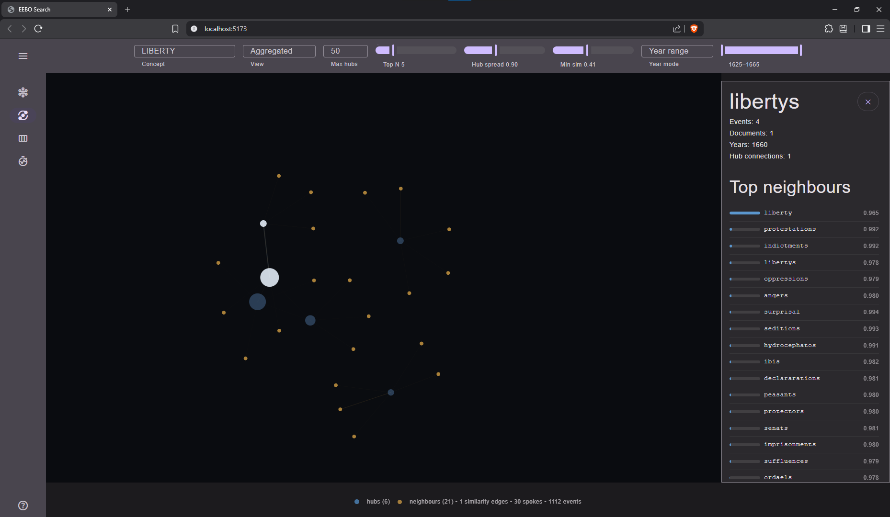
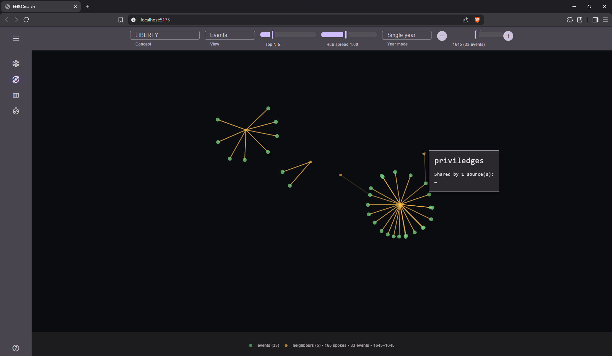
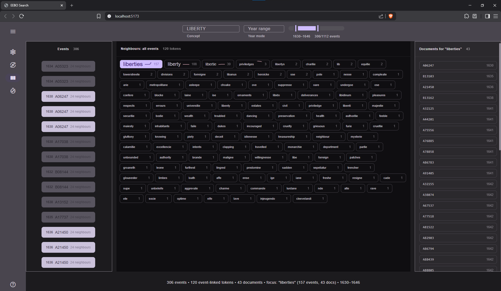
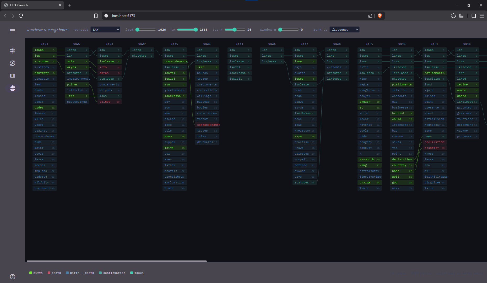
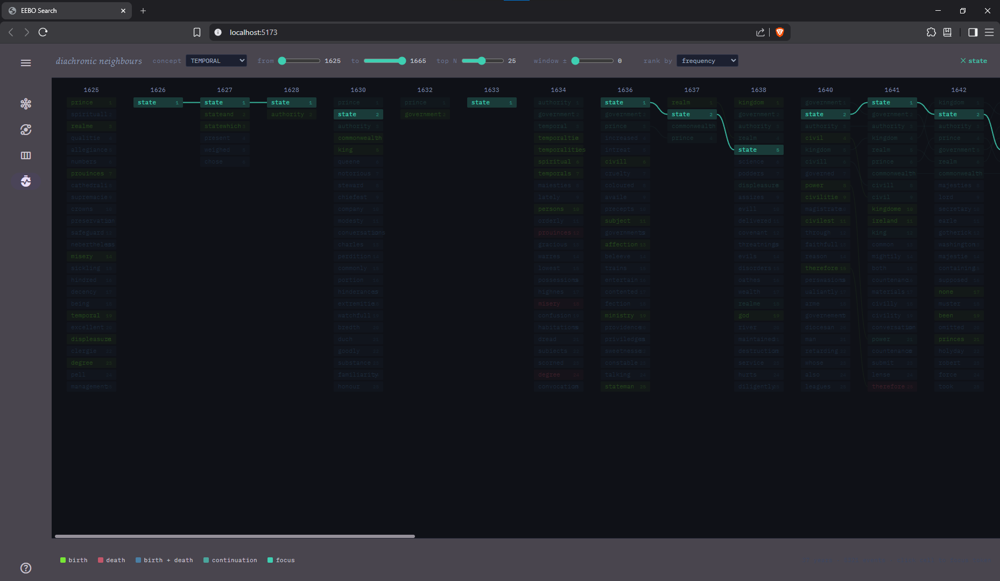
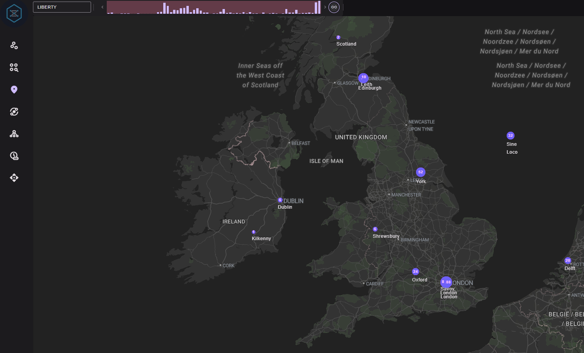

# _Mutatis Mutandis_

    git@github.com:leegee/mutatis-mutandis.git
    https://github.com/leegee/mutatis-mutandis.git

## Code Synopsis

    conda activate eebo_env             # Load Python environment
    ./pipeline --all                    # Ingest the XML corpus from eebo_all
    ./run-ws.sh                         # Run the WebSocket service for diachronic search
    cd gui/eebo-frontend && bun dev     # Run the frontend dev server

## Conceptual Synopsis

> Who today is using the concept of liberty as it was used by Milton, or Hobbes, or Locke?
>
> Who during the 1600s was expressing in their own language concepts we differntly express today?
>
> Who were the terrorists of the 17th century? (Fanatics, Sectaries, Enthusiasts, Levellers, Diggers, Muggltonians, Anabaptists, Jesuits...)
>
> How in the past was the concept we term X referenced  if at all?

Can we recursively reverse search over diachronic ranges, taking top results for each period as bridge terms to search with in the earlier  date range?

## Progress

Ideally this project would build a complete Ontological Topology of a corpus, a gigantic semantic space as a structured geometric object, where meaning is illustrated by relative positions, continuity and deformation of distributions across time, rather than through dictionaries. Nice idea but requires 2-5 days GPU or about 6 weeks of CPU...

So: instead of corpus-wide embedding, we recursively probe system where semantic topology is reconstructed through anchored neighbourhood expansion rather than exhaustive representation.

    EEBO-TCP TEI XML
            |
    Postgres (text + meta)
            |
    Zarr (event log: contextual embeddings)
            |
    FAISS (approximate semantic geometry index)
            |
    Query layer (token/window/hybrid encoding)
            |
    Analysis (drift, clustering, interpretation)
            |
    GUI (Solid, d3, CosmosGL, DeckGL)


Currently experimenting with ensemble embeddings. Ideally would process  clauses, sentances and paragraphs, but MacBERTh is somewhat restricted and EEBO somewhat noisy, so that is not trivial.

- Zarr store extended
- New columns (event_type, span_*) populated
- Backward compatibile

## Architecture



## Deps list

    conda list --export > requirements.txt

Moving to UV

## Colab Notebooks

Update `./macberth_pg_secrets.json` on Google Drive's root dir with the host/port output from `ngrok tcp 5432`.

Don't forget to restart the Colab session when the IP changes.

(Colab workbooks is well out of date)

## Bibliography

See [Bibliography](./BIBLIOGRAPHY.md)

## CPU-Bound

For now the methodology is focuosed on my ancient CPU-only (Radeon...), 64 GB setup so fastText over MacBERTh.

## To Do

1. api result paging
1. expose tier 2's analytics
1. run tier 1's 'masked' path in the Cloud

### DB

- Tidy MV `pamphlet_tokens` and use a join rather than cutting corners
- Tidy schema and put it in its own file!

### EEBO-TCP Language Composition

Within the activated corpus bounds prior to `langdetect`:

```
eebo=# SELECT lang, COUNT(*) AS count
eebo-# FROM documents
eebo-# GROUP BY lang
eebo-# ORDER BY count DESC;
 lang | count
------+-------
 eng  | 39623
 lat  |   255
 wel  |    83
 fre  |    48
 frm  |     8
 dut  |     7
 mul  |     2
 sco  |     2
 spa  |     2
 ger  |     2
 grc  |     1
 gla  |     1
 new  |     1
 por  |     1
 ```

## Screenshots











## Notes

A91273 = ID 99863437 = _Salus populi solus rex_ (London, October 17, 1648) = Thomason Tracts collection E.467 = _Salus populi solus rex = The peoples safety is the sole soveraignty, or The royalist out-reasoned [electronic resource] : calculated for the hopefull recovery of the considerate royalist, from the dangerous infection of the slie sophistry of Iudge Ienkings: in his late legend, published to perswade the people into a voluntary slavery, and obliged servitude to the Kings pleasure: most irrationally asserting, that the King is principium, caput, & finis Parliamenti. That the Parliament hath a power over our lives, liberties, laws, and goods, according to the known laws of the land._ cf https://catalog.folger.edu/record/501701


