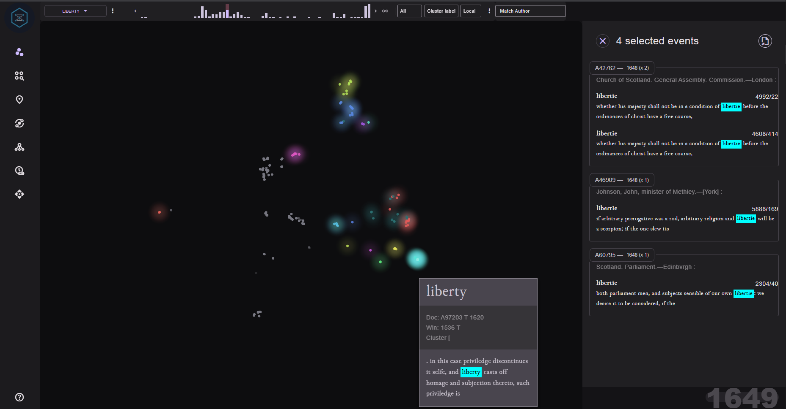
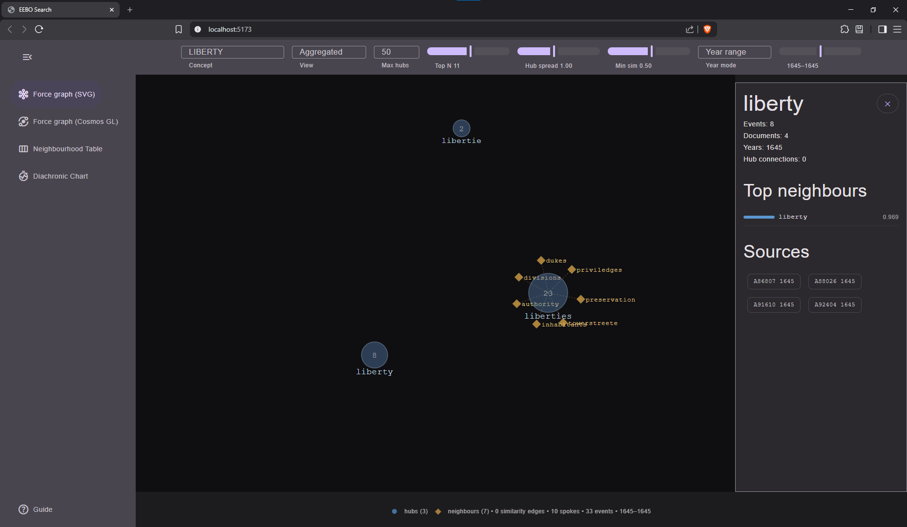
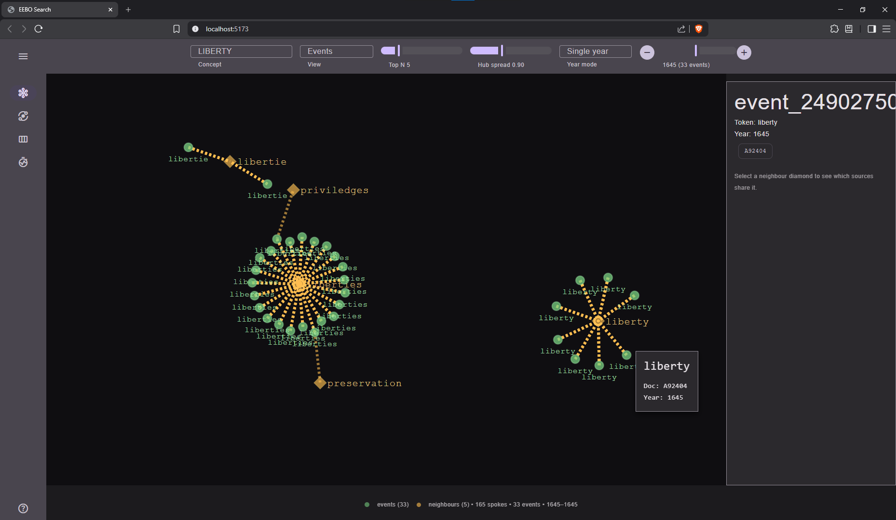
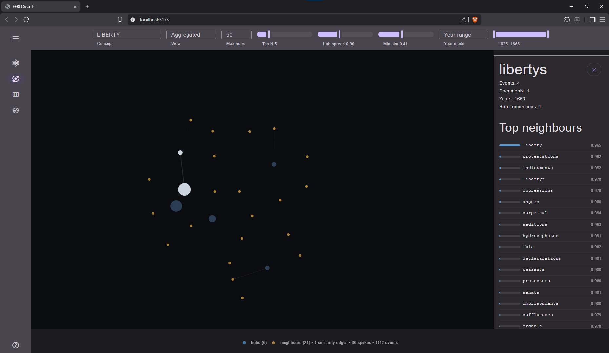
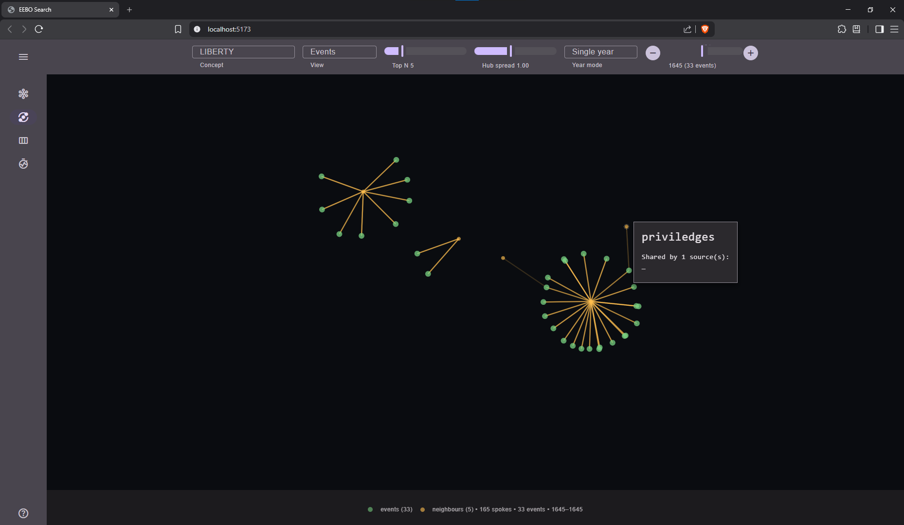
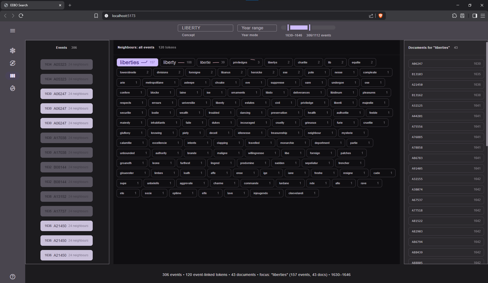
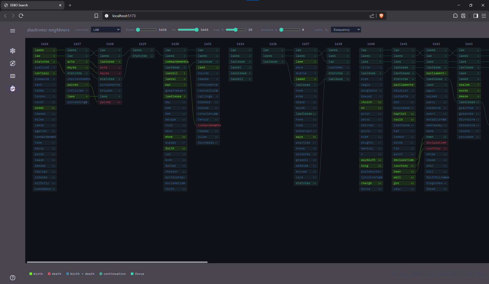
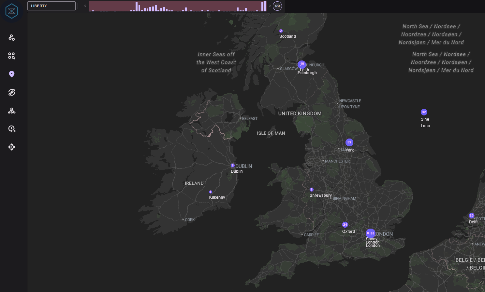

# _Mutatis Mutandis_

    git@github.com:leegee/mutatis-mutandis.git
    https://github.com/leegee/mutatis-mutandis.git

        We all declare for liberty but in using the same word we do not all mean the same thing
        -- Abraham Lincoln, Address at the Sanitary Fair in Baltimore, Maryland, on April 18, 186

## Code Synopsis

    cd $PROJECT_ROOT/gui/research && bun dev    #  Research graph

    cd $PROJECT_ROOT/python
    source .venv/Scripts/activate               # Load environment

    cd $PROJECT_ROOT
    uv sync
    uv pip install -e .
    python src/tier.... in order

## Conceptual Synopsis

The project follows prior art as much as possible to provide a context within which to
satisfactorily answer the following questions through close reading of well-known and less
well-known texts in a corpus composed through intuitively-gathered and mechanically identified
source material from Noah, Daniel, John of Patmos, through Buldr, Balðraz/Baldr through Stoker
and Eco, to include texts that, when embeddeded in a MacBERTh vector space, cluster with the named
sources which, if you will, act as seeds in the embedding vector space from which we collect kNN
to populate an ANN (currently Lance after scaling-up from FAISS and Zarr).

* Who today is using the concept of liberty as it was used by Milton, or Hobbes, or Locke?
* How in the past was the concept we term `X` referenced, if at all?
> [!INFO]
> (ie reverse diachronic semantic search, in this case multi-modal but generally bucketed to help
> the Procrustes alignment of vector spaces from diffeernt models)

* Who during the 1600s was expressing in their own language concepts we differntly express today?
> [!INFO]
> (forward diachronic semantic search)

* How was our contemporary concept of privacy referenced in the past?
> [!INFO]
> (cf Entick v Carrington, 1765, secretedness, and semantic drift)

* Who were considered terrorists in the 17th century? (Fanatics, Sectaries, Enthusiasts, Levellers, Diggers, Muggltonians, Anabaptists, Jesuits...)
> [!INFO]
> (reverse diachronic semantic search for embedded phrases - careful attention paid to "carrier" phrase that produces the embedding of the search term)

* How did the image of the 1 Enoch's Noah, the Ancient Of Days, the Son Of Man end up as medicalised and/or grotseque and threatening in the 19th 20th century?

* How does one identify in social media posts calls to violence against a specific group when the coded language constantly evolves?

### Specifically and in depth:

  * how has the typological symbol expressed by Enoch's Noah, The Ancient of Days, The Son Of Man, Stoker's Dracula and the villians of Eco,
  * been transmitted and received through the millennia and how has it interacted with surrounding physiognomy imagery?

  * What do the contextual embeddings of 'albino' and 'albinism' retrieve through past centuries and in European traditions for which we have corpus?
    > ie Given that albino is a lexicalised concept in the 19th century, can we discover earlier textual representations of the same/similar
    > phenomenon without assuming beforehand which words expressed it?

    * Can we recursively reverse search over diachronic ranges, taking top results for each period as bridge terms to search with in the earlier  date range?

## Progress

Ideally this project would build a complete Ontological Topology of a corpus, a gigantic semantic space as a structured geometric object, where meaning is illustrated by relative positions, continuity and deformation of distributions across time, rather than through dictionaries. Nice idea but requires 2-5 days GPU or about 6 weeks of CPU...

We tried avoiding corpus-wide embedding, we recursively probe system where semantic topology is reconstructed through anchored neighbourhood expansion rather than exhaustive representation, and performed recursively in reverse chronological order:

1. Search 2026-1926: search 'privacy' - store semantic neighbours
1. Search 1826-2026: search above neighbours, store and repeat for previous century, etc

When we added the EEBO Bibles, FAISS failed us. Now we have added selected texts from ECCO and CLMET, we have had to switch to a disk-based ANN system.

Microsoft's old DiskANNpy library failed at scale, and although the new version in Rust looks promising, there is no Python interface and
not sure we yet have time to fast-itterate in Rust.

Currently trying embeddings over the full corpus with the open source Lance for our 16,000,000 embeddings.

So should we, instead of treating the corpus as an exhaustively represented semantic space to be queried by fixed lexical anchors, instead recursively probe it through anchored neighbourhood expansion, reconstructing semantic topology from contextual observations while traversing the corpus in reverse chronological order.


```
        XML Corpus
            |
    Postgres (text + meta)
            |
    Parquet or Zarr (event log: contextual embeddings)
            |
    LanceDB or FAISS (approximate semantic geometry index)     TODO Check: Milvus
            |
    Query layer (token/window/hybrid encoding)
            |
    Analysis (drift, clustering, interpretation)
            |
    GUI (Solid, d3, CosmosGL, DeckGL)
```

Currently experimenting with ensemble embeddings. Ideally would process clauses, sentances and paragraphs, but MacBERTh is somewhat restricted and EEBO somewhat noisy, so that is not trivial to use or create a sentence transformer.

## Dependencies

Managed by UV (`uv sync`) and bun (`bun install`)

## Next Steps

### Classification: not quite sentiment analysis

* Investigate prior art: **Osgood**'s semantic differential; **Mehrabian & Russell** / **Warriner et al.** on Valence–Arousal–Dominance (VAD); **NRC VAD Lexicon** (Mohammad).
* Investigate **SentProp** — Hamilton, Clark, Leskovec & Jurafsky: seed-based, embedding-derived domain sentiment lexicons, including diachronic sentiment change.
* Investigate historical emotion/affect work using VAD and historical expert annotation (e.g. **Buechel et al.**).
* Experiment with MacBERTh embeddings + seeded **conceptual poles** rather than imposing modern positive/negative sentiment.
* Explore **Koselleck-style historically motivated poles** (e.g. sacred ↔ pathological, pure ↔ polluted) and measure contextual observations relative to their centroids.
* Test whether pole vocabularies can be induced/validated from embedding neighbourhoods and tracked diachronically.
* Keep VAD as an external baseline; investigate whether historically derived affective/evaluative fields provide a more appropriate model for EEBO.


## Colab Notebooks

Update `./macberth_pg_secrets.json` on Google Drive's root dir with the host/port output from `ngrok tcp 5432`.

Don't forget to restart the Colab session when the IP changes.

## Sources

* [The Corpus of Late Modern English Texts, version 3.1](https://fedora.clarin-d.uni-saarland.de/clmet/clmet.html)
* [Eighteenth Century Collection Online TCP](https://github.com/Text-Creation-Partnership/ECCO-TCP)
* [Early English Books Online TCP](https://github.com/Text-Creation-Partnership/EEBO-TCP-Collections-Navigations)

## Bibliography

See [Bibliography](./BIBLIOGRAPHY.md)

## CPU-Bound

For now the methodology is focuosed on my ancient CPU-only (Radeon...), 64 GB setup so fastText over MacBERTh. DirectML sometimes
works, sometimes dies horribly.

## APIs

Every tier has the folllowing:

        main()    = argument parsing, constructs expensive resources
        core()    = the implementation, uses expensive resources
        run()     = one-shot CLI/notebook convenience wrapper
        service() = reusable programmatic API, requires expensive resources

## In Progress

1. extending API to tiers 3+
1. enlgarging the corpus (streaming)
1. parquet

        export OMP_NUM_THREADS=1
        export MKL_NUM_THREADS=1
        export OPENBLAS_NUM_THREADS=1
        export NUMEXPR_NUM_THREADS=1
        export ORT_NUM_THREADS=1
        export OMP_WAIT_POLICY=PASSIVE
        python src/tier1/tier1_0_corpus2zarr.py \
        --store-backend parquet \
        --report-every 1
        --batch-size 32 \
        --store g:/corpus-out/parquet/


### EEBO-TCP Language Composition

Within the activated corpus bounds prior to `langdetect`:

```
eebo=# SELECT lang, COUNT(*) AS count
eebo-# FROM documents
eebo-# GROUP BY lang
eebo-# ORDER BY count DESC;
 lang | count
------+-------
 eng  | 39623
 lat  |   255
 wel  |    83
 fre  |    48
 frm  |     8
 dut  |     7
 mul  |     2
 sco  |     2
 spa  |     2
 ger  |     2
 grc  |     1
 gla  |     1
 new  |     1
 por  |     1
 ```

## Screenshots











## Notes

A91273 = ID 99863437 = _Salus populi solus rex_ (London, October 17, 1648) = Thomason Tracts collection E.467 = _Salus populi solus rex = The peoples safety is the sole soveraignty, or The royalist out-reasoned [electronic resource] : calculated for the hopefull recovery of the considerate royalist, from the dangerous infection of the slie sophistry of Iudge Ienkings: in his late legend, published to perswade the people into a voluntary slavery, and obliged servitude to the Kings pleasure: most irrationally asserting, that the King is principium, caput, & finis Parliamenti. That the Parliament hath a power over our lives, liberties, laws, and goods, according to the known laws of the land._ cf https://catalog.folger.edu/record/501701


# From Anti-Semitism Detection to Diachronic Semantic Search

## Overview

My earlier work for the Campaign Against Antisemitism (CAA) involved using computational methods to identify anti-Semitic and potentially violent content in social-media posts. That work, undertaken more than a decade ago, was subsequently published on GitHub in the [GLM repository](https://github.com/leegee/GLM). The Oxford Internet Institute has since undertaken related work in this area.

My proposed Digital Humanities PhD extends a related set of methodological concerns into historical text analysis, using the Early English Books Online (EEBO) corpus as a test case. The connection is not simply the application of the same machine-learning techniques to a different corpus. It is the broader problem of identifying meaningful patterns in language when their expression is variable, indirect, context-dependent, and sometimes historically unfamiliar.

## The Common Problem: Meaning Beyond Keywords

Anti-Semitic narratives can be expressed through explicit hostility, recurring conspiracy claims, euphemisms, coded references, or allusions that depend on shared contextual knowledge. A keyword search may identify explicit examples while missing more indirect expressions. A classifier can improve detection but may still struggle with ambiguity, irony, quotation, context, and evolving terminology.

Historical research presents a related challenge. A researcher investigating a concept such as *liberty* in seventeenth-century pamphlets may need to find relevant arguments expressed through terms such as *freedom*, *privilege*, *immunity*, *property*, or *the ancient constitution*. These expressions are not necessarily equivalent, but some may articulate related aspects of the concept under investigation.

In both cases, the task is to move from particular linguistic expressions towards broader patterns of meaning without assuming that words, passages, or documents are interchangeable merely because they appear similar.

## Methodological Continuities

Four principles connect the earlier anti-Semitism work with the proposed EEBO research:

1. **Pattern detection beyond isolated words.** Meaning can emerge through recurring claims, rhetorical structures, associations, and relationships between expressions. Computational methods can help identify candidates that literal keyword searches miss.

2. **Recognition of linguistic variation.** A concept or narrative may be expressed in multiple ways. Embeddings can help retrieve passages with related contextual meanings, but similarity alone cannot establish that two expressions perform the same function or convey the same idea.

3. **Attention to change over time.** Contemporary online discourse can develop new terminology and coded conventions; historical discourse changes over longer periods and within different cultural, political, and textual contexts. Historical retrieval must therefore account for period-specific usage rather than assuming modern meanings remain stable.

4. **Evidence preservation and human interpretation.** Computational results must remain traceable to their original sources. A retrieved social-media post or historical passage is evidence for an analyst to assess, not a self-sufficient conclusion produced by a model.

## Detection and Discovery: An Important Distinction

The two projects have related methods but different primary objectives.

* **Anti-Semitism detection** starts with a defined category of content and seeks to identify, classify, or investigate examples of it. Evaluation may consider precision, recall, false positives, false negatives, and agreement between analysts.

* **Diachronic semantic search** starts with a research question or concept and seeks relevant historical evidence, including passages that do not use the researcher's initial terminology. Evaluation must consider historical relevance, retrieval coverage, interpretability, and the usefulness of results for subsequent research.

The historical search problem is therefore not simply to classify texts into predefined categories. It is to help researchers discover evidence whose relevance may not be apparent from its vocabulary alone.

## Application to the EEBO Project

The current EEBO system uses MacBERTh embeddings to retrieve contextually related passages and supports exploration at different contextual scales. Seed-based retrieval allows a researcher to begin with known examples or expressions and explore related material beyond literal matches.

Occurrence-level provenance is essential: retrieved results should be traceable to their documents, passages, dates, and token positions. This allows researchers to examine the original wording and context rather than treating vector-space proximity as a historical interpretation.

The system should be evaluated against lexical baselines and human judgements, with explicit attention to false positives, missed evidence, and passages that appear similar computationally but are not relevant to the research question. The objective is not merely to retrieve similar language, but to establish whether the system helps researchers find useful evidence that conventional searches would overlook.

## Relevance to the Proposed PhD

The earlier work provides a practical foundation in computational analysis of socially consequential language. It is relevant to the proposed PhD in three distinct ways:

* **Prior experience:** developing computational methods to identify patterns in large collections of text.

* **Methodological continuity:** investigating how systems can find meaningful linguistic patterns beyond explicit keywords.

* **Research contribution:** developing and evaluating retrieval methods that are sensitive to historical language variation and preserve the provenance necessary for scholarly interpretation.

The earlier work should be presented as a methodological precursor, not as proof that techniques developed for contemporary social media will transfer directly to early modern texts. The PhD must establish its own contribution through engagement with existing research, comparative experiments, and rigorous evaluation.

## Central Research Question

**How can computational systems retrieve evidence relevant to a research concept when its expression varies across texts, contexts, and historical periods, while preserving the evidence needed for human interpretation?**

The anti-Semitism work illustrates the practical importance of finding patterns that are not reducible to keywords. EEBO provides a historically grounded test case in which the challenge is to retrieve evidence across changing vocabularies without collapsing distinct meanings into a single computational category.

The central contribution is thus a move from detecting instances of a known class of linguistic phenomena towards supporting the discovery of historically variable expressions of a research concept. The system should make it possible to find otherwise overlooked evidence, explain why passages were retrieved, and leave the interpretation of that evidence open to informed human judgement.
